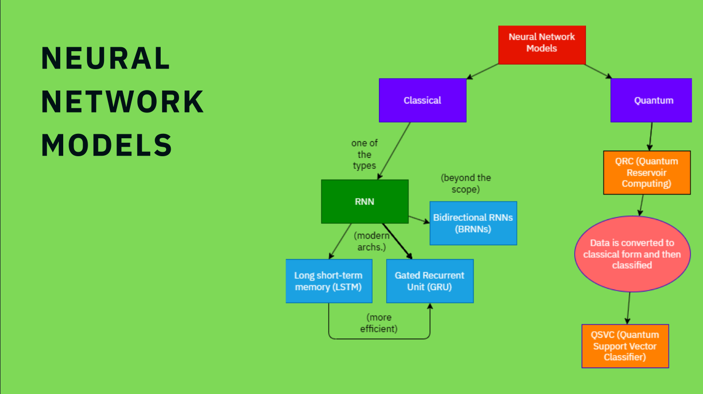
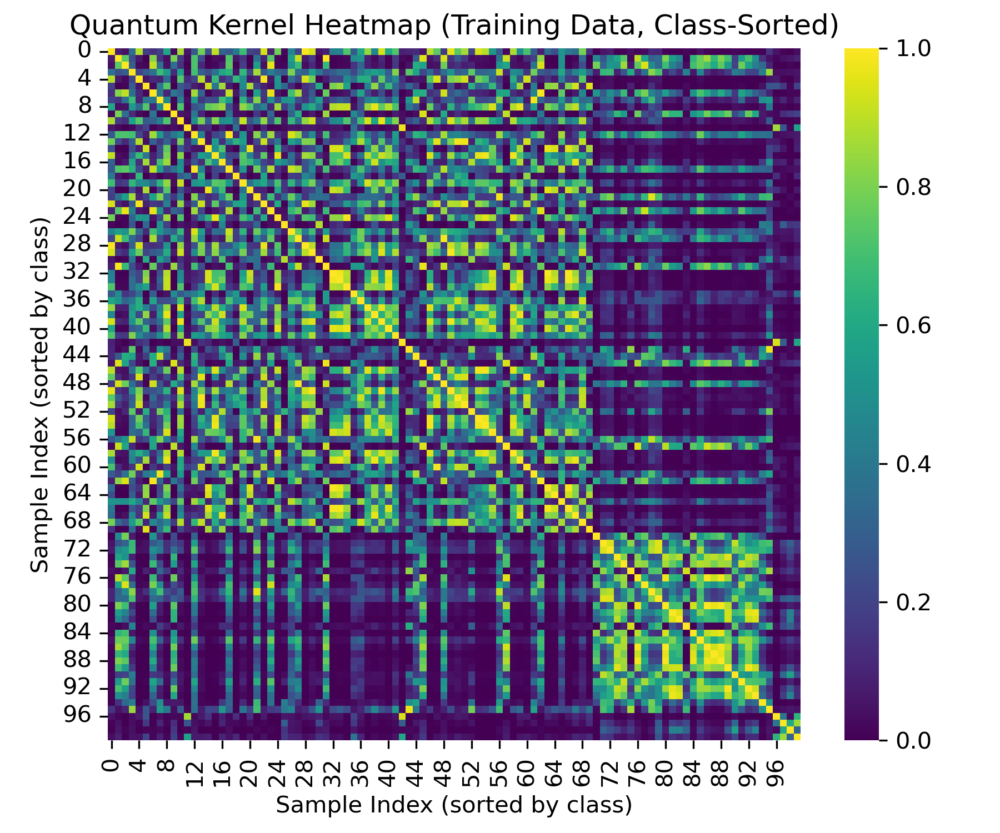
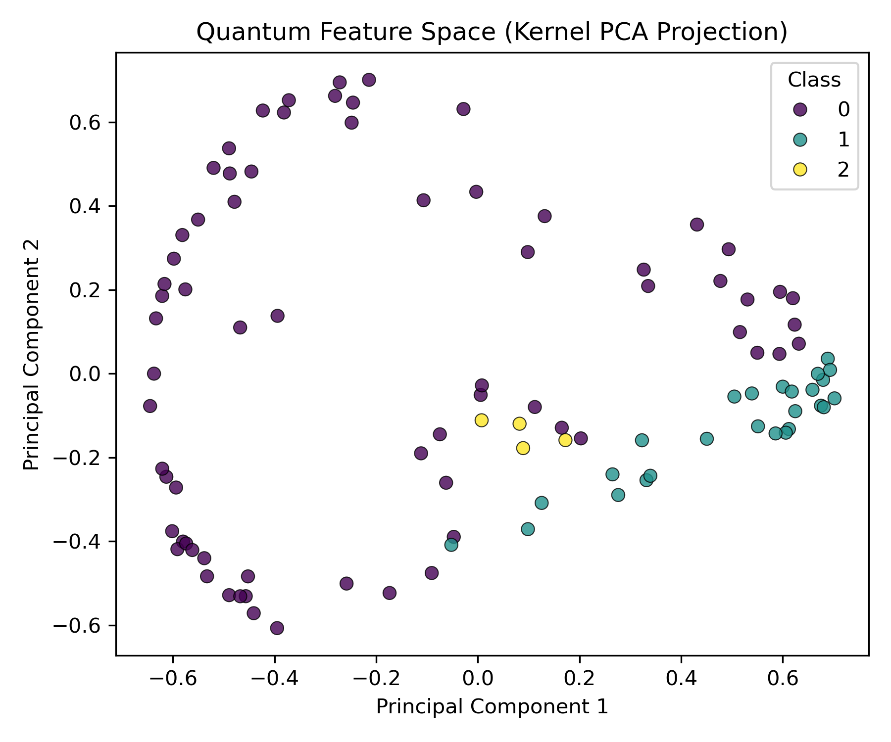
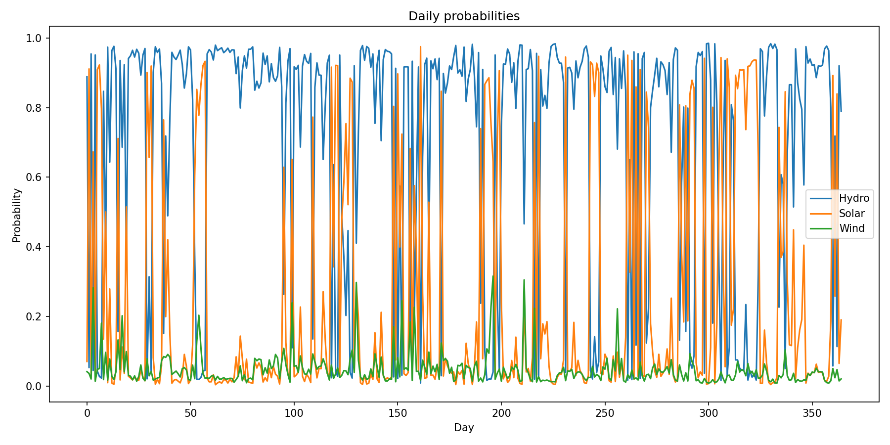

# IBM Qiskit

## Problem Statement

**Quantum Reservoir Computing for Renewable Energy Forecasting**

**Background**: Renewable energy sources such as wind and solar exhibit high variability due to environmental fluctuations. Accurate forecasting of their output is crucial for sustainable grid management. Quantum Reservoir Computing (QRC) integrates quantum dynamics with classical regression, providing an alternative to recurrent networks for modeling complex, nonlinear time series.

**Task**: Participants can apply Quantum Reservoir Computing to predict renewable energy generation based on historical weather features like wind speed and irradiance. The results can be compared to a classical RNN to evaluate efficiency and stability.

**End Result (expected)**: We will be able to predict with quantum models with higher accuracy, faster. 

To view the general canva file, view: [Canva Link](https://www.canva.com/design/DAG3MuhGYXk/EdQz3bmG8W6MSe5ZGZhA6Q/edit?utm_content=DAG3MuhGYXk&utm_campaign=designshare&utm_medium=link2&utm_source=sharebutton)

## Preface

The increasing reliance on renewable energy sources is essential for sustainable grid management, but it introduces significant challenges due to the inherent volatility of sources like wind. The output of a wind turbine is a complex, non-linear time series governed by chaotic environmental factors, making it difficult to predict. Thus years of research are required before implementing the sustainable energy source.

Recently, the usage of classical algorithms and the advent of AI has reduced this time frame to a mere 6 months. In this github repo, we will be using a changed version of the RNN models, like LTSM, to establish a baseline to compare against the results of a futuristic model to be proposed.

However, it is the need of the hour to implement the sources as soon as possible. Thus, we need to shift to quantum models as they intrinsically store and understand relations in the n-dimensional space via the use of superposition, entnglement. By leveraging solution filters, we can classify and condense the quantum probablities into their most probable output states.



# Recurring neural networks

* Recurrent Neural Networks (RNNs) are used in any application that involves sequential data, where the order of information matters. Their internal memory allows them to process and understand context in sequences like text, speech, and time-series data.
* Only RNNs are capable of Time-Series Analysis & Forecasting where they are specialized for finding temporal or sequential patterns (patterns over time or in a specific order)
* At their core, Recurrent Neural Networks (RNNs) work by having a loop that allows information to be passed from one step of the network to the next.

## Types of RNNs

* **Long Short-Term Memory (LSTM):** LSTMs are the most popular and widely used RNN architecture. They are explicitly designed to remember information for long periods.
* **Gated Recurrent Unit (GRU):** A GRU is a newer and simpler alternative to the LSTM. It provides similar performance on many tasks but is more computationally efficient.
* **Bidirectional RNNs (BRNNs):** *(beyond the scope of this problem)* This architecture processes the input sequence in two directions: once from beginning to end (forward) and once from end to beginning (backward).

We have used a LSTM model for baseline comparison

## What is Quantum Reservoir Computing?

- Quantum Reservoir Computing (QRC) is a machine learning model that uses the complex dynamics of a quantum system as a computational resource. It's an extension of classical reservoir computing.
- Instead of a classical neural network, QRC uses a "reservoir" of interconnected quantum bits (qubits). Input data is fed into this quantum reservoir, causing its complex quantum state to evolve in time. This reservoir remains fixed and is not trained. The quantum properties of superposition and entanglement allow it to map the input data into a much higher-dimensional space.
- Finally, a simple, classical linear "readout" layer is trained to interpret the quantum state measurements from the reservoir and produce the desired output, making it well-suited for processing complex temporal data.

## System Architecture for the Quantum Segment

**Project Title:** Hybrid Quantum-Classical System for Renewable Energy Source Classification

**Objective:** To build a proof-of-concept system using PennyLane that processes time-series weather data to recommend the most viable renewable energy source (e.g., Solar, Wind, Hydro) for a given location. The system will use a Quantum Reservoir Computer (QRC) for feature extraction and a Quantum Support Vector Classifier (QSVC) for classification.

**Core Technologies:**

* **PennyLane:** For all quantum circuits (QRC and QSVC).  
* **Scikit-learn:** For classical data processing, SVC (Support Vector Classifier), and metrics.  
* **NumPy:** For all numerical data and vector operations.  
* **Matplotlib:** For visualization.

### **Step-by-Step Implementation Plan**


#### **Phase 1: Setup and Mock Data Generation**

1. **Imports:** Import all necessary libraries (PennyLane, qml.device, QNode, NumPy, Matplotlib, and sklearn).  
2. **Global Constraint:** Define a global boolean variable HAS\_RIVER\_IN\_AREA \= True. We will use this later to constrain the model.  
3. **Mock Data Function:** Create a function generate\_mock\_data(days=365).  
   * This function should return a NumPy array of shape (days, 3\) representing daily weather features: \[solar\_irradiance, wind\_speed, water\_flow\].  
   * It should also return a corresponding array of labels (days,).  
   * **Label Logic:** Create a simple function get\_label(features) that returns a string label.  
     * If solar\_irradiance is the dominant feature, return "Solar".  
     * If wind\_speed is dominant, return "Wind".  
     * If water\_flow is dominant AND HAS\_RIVER\_IN\_AREA is True, return "Hydro".  
     * If water\_flow is dominant BUT HAS\_RIVER\_IN\_AREA is False, return "None" (or the next dominant type).  
     * Otherwise, return "Mixed".  
   * Generate 365 days of data.

#### **Phase 2: Module 1 \- The Quantum Reservoir Computer (QRC)**

This module's goal is to take a day's weather features and the previous day's reservoir state to generate a new, high-dimensional reservoir state.

1. **Define Reservoir Circuit:**  
   * Create a PennyLane quantum device (e.g., default.qubit with n\_qubits \= 5).  
   * Create a QNode qrc\_circuit that implements the "Quantum Dynamics" part. This circuit should take the previous reservoir state (as parameters for rotation gates) and apply a fixed, entangling layer (e.g., qml.StronglyEntanglingLayers).  
2. **Define Input Encoding:**  
   * Create a simple classical function encode\_input(features, n\_qubits). This function will map our 3 weather features to the n\_qubits of the reservoir. (e.g., repeating and scaling features to create an n\_qubit-sized vector).  
3. **Create the Reservoir "Driver" Function:**  
   * Create a function run\_qrc(daily\_features\_list).  
   * This function should:  
     * Initialize a starting reservoir state (e.g., zeros).  
     * Create a list to store the final reservoir state for each day.  
     * Loop through each day's features in daily\_features\_list:  
       * Combine the encoded input features with the previous reservoir state.  
       * Run the qrc\_circuit with these combined parameters.  
       * Measure the expectation values (e.g., qml.expval(qml.PauliZ(i)) for each qubit) to get the *new* reservoir state.  
       * Store this new state.  
   * This function should return a list of high-dimensional vectors, where each vector represents the "condensed" time-series information for that day. This aligns with **Step 1** of our plan.

#### **Phase 3: Module 2 \- Classical Condensation (Vector-to-Image)**

As per **Step 3** of our plan, we need to convert the reservoir's output vector into an "image" (2D matrix) for the QSVC.

1. **Gramian Angular Field (GAF) Function:**  
   * Please provide a simple Python/NumPy function vector\_to\_image(vector).  
   * This function will implement a **Gramian Angular Summation Field (GASF)**.  
   * It should:  
     1. Take the 1D reservoir state vector.  
     2. Rescale it to be in the \[-1, 1\] range.  
     3. Calculate the GAF matrix.  
     4. Return this 2D matrix (our "image").  
   * *(Optional Visualization):* Show how to use matplotlib.pyplot.imshow to visualize one of these "images." This helps with **Step 2** of our plan.

#### **Phase 4: Module 3 \- The Quantum Support Vector Classifier (QSVC)**

This module will classify the "images" from Phase 3, fulfilling **Step 4** of our plan.

1. **Prepare Data for QSVC:**  
   * Run all 365 days of mock data through run\_qrc (Phase 2\) to get 365 reservoir vectors.  
   * Run all 365 vectors through vector\_to\_image (Phase 3\) to get 365 "images."  
   * Flatten these images (e.g., if 5x5, flatten to 25x1) so they can be used as feature vectors by the QSVC.  
   * Get the corresponding labels from our mock data function.  
   * **Apply Constraint:** If HAS\_RIVER\_IN\_AREA \= False, filter out *all* samples labeled "Hydro". The QSVC should never be trained on this class.  
   * Split the data into a training (X\_train, y\_train) and testing (X\_test, y\_test) set.  
2. **Define the Quantum Kernel:**  
   * Define a quantum feature map circuit (e.g., qml.AngleEmbedding) as a QNode. This circuit will take one flattened "image" vector as its features argument.  
   * This QNode will be used by PennyLane to calculate the similarity between data points. Ensure the embedding is appropriate for the flattened image size.  
3. **Create and Train the SVC (using the Quantum Kernel):**  
   * Use the qml.kernels.kernel\_matrix function to compute the kernel matrix for the training data. This function will repeatedly run your feature map QNode.  
     * kernel\_train \= qml.kernels.kernel\_matrix(X\_train, X\_train, kernel=your\_feature\_map\_qnode, ...)  
   * Initialize a classical sklearn.svm.SVC with kernel='precomputed' and probability=True.  
   * Train the SVC on the *precomputed training kernel matrix* (kernel\_train) and the training labels (y\_train).  
4. **Evaluate the Model:**  
   * Compute the test kernel matrix, which compares *test* data to the *training* data:  
     * kernel\_test \= qml.kernels.kernel\_matrix(X\_test, X\_train, kernel=your\_feature\_map\_qnode, ...)  
   * Use svc.predict(kernel\_test) and svc.predict\_proba(kernel\_test) to get results for the test set.  
   * Print a classification report.

#### **Phase 5: Module 4 \- Annual Analysis and Recommendation**

This module implements the final logic from **Steps 5 and 6** of our plan.

1. **Run Full-Year Simulation:**  
   * Take the full 365-day dataset (we'll call it X\_full).  
   * Run it through the first two parts of the pipeline:  
     * qrc\_vectors \= run\_qrc(X\_full)  
     * image\_vectors \= \[vector\_to\_image(v) for v in qrc\_vectors\]  
     * X\_full\_flat \= \[img.flatten() for img in image\_vectors\]  
   * **Important:** To get probabilities, you must compute the kernel comparing the full dataset to the *original training data* (X\_train) that the SVC was trained on.  
     * kernel\_full\_year \= qml.kernels.kernel\_matrix(X\_full\_flat, X\_train, kernel=your\_feature\_map\_qnode, ...)  
   * Get the daily probabilities:  
     * daily\_probabilities \= qsvc.predict\_proba(kernel\_full\_year)  
   * Store these daily probability scores. These are the "thresholds" from **Step 5**.  
2. **Implement Recommendation Logic:**  
   * Create a final analysis function.  
   * **Tally Scores:** Calculate the *total* probability score for each energy type over the 365 days.  
   * **Find Best Timeframes:** Find the month (or 30-day window) with the highest average score for each energy type.  
   * **Generate Recommendation:**  
     * Find the energy type with the highest total score (e.g., "Solar").  
     * Check if the second-highest type's score is close (e.g., within 90% of the top score).  
     * Print a final summary:  
       * "Primary Recommendation: \[Top Energy Type\] (Peak Season: \[Best Month\])"  
       * If a second type is close: "Secondary Recommendation: \[Second Energy Type\] (Peak Season: \[Best Month\])"


## Results of each model independently:

### For the quantum model:

(See qsv.ipynb)

When we gave it with a weatherHistory.csv; we also adjusted feature parameters within the code to make the model a bit more measured.

```
FEATURE_THRESHOLDS = {
    "solar_irradiance": 0.35,   # Top ~10-15% of temperature range
    "wind_speed": 0.20,         # Top 10% of wind range
    "water_flow": 0.40         # Top ~15% of humidity range
}
```


After messing around with the weights and thresholds of the code for a bit, we came about this:

```
✅ Using dataset: /home/sugeethjsa/Documents/GitHub/dhivyanj/qff25-hthn/weatherHistory.csv
HYBRID QUANTUM-CLASSICAL RENEWABLE ENERGY CLASSIFIER (demo)
✅ Using local dataset: /home/sugeethjsa/Documents/GitHub/dhivyanj/qff25-hthn/weatherHistory.csv
Loaded /home/sugeethjsa/Documents/GitHub/dhivyanj/qff25-hthn/weatherHistory.csv with shape (96453, 12)
Loaded 365 days; unique labels: ['Hydro' 'Solar' 'Wind']

--- DEBUG: POST-LOAD INSPECTION ---
Unique labels generated: (array(['Hydro', 'Solar', 'Wind'], dtype='<U5'), array([258,  89,  18]))
--- END DEBUG ---

Running QRC on 365 days... (this may be slow with many qubits/layers)
  Processed 50/365 days
  Processed 100/365 days
  Processed 150/365 days
  Processed 200/365 days
  Processed 250/365 days
  Processed 300/365 days
  Processed 350/365 days
Reservoir states shape: (365, 5)
Saved example GASF image as gasf_example_day1.png
Label mapping: {'Hydro': 0, 'Solar': 1, 'Wind': 2}
✅ Computed class weights: {0: 0.4715762273901809, 1: 1.3670411985018727, 2: 6.7592592592592595}
Training QSVC: 292 train samples, 73 test samples
Computing training kernel matrix (may take time)...
Image generated.
✅ Saved class-sorted quantum kernel heatmap as quantum_kernel_heatmap_sorted.png
🌀 Performing Kernel PCA for 2D visualization...
✅ Saved Kernel PCA projection as quantum_kpca_projection.png
Computing test kernel matrix...

Classification Report:
              precision    recall  f1-score   support

           0       0.94      0.98      0.96        51
           1       0.83      0.83      0.83        18
           2       1.00      0.50      0.67         4

    accuracy                           0.92        73
   macro avg       0.93      0.77      0.82        73
weighted avg       0.92      0.92      0.91        73

Computing kernel between full-year data and training set...

==================================================
RENEWABLE ENERGY RECOMMENDATION
==================================================
Primary recommendation: Hydro (score 257.40)
==================================================
Saved daily_probabilities.png
```

while performing a local run on a Linux Laptop with 11th gen i5 and 8 GB RAM; via simulation.

Here are the images that were generated by using seaborn for heatmap visulasation and MATplotLIB for plotting.








## Future Scope:

1. Dashboard based integration and dynamically uploading data. Skeleton work of the same is present here in the repo.
2. We can also work on improving the security of energy grids as the renewable sources are prone to environmental hijacking by third party bad actors (basically "hacking" in the world of sociology and biology); by using the quantum models for dynamic load balancing; so that our smart bidirectional energy grid supply can survive even in the face of catastrophic failure due to resource reallocation.


## Research

1. Revealing prediction of perched cum off-centered wick solar still performance using network based on optimizer algorithm - [https://www.sciencedirect.com/science/article/abs/pii/S0957582022002099?via%3Dihub](https://www.sciencedirect.com/science/article/abs/pii/S0957582022002099?via%3Dihub)
2. Resilient solar microgrid management using multi-agent reinforcement learning and quantum-based action selection
 - [https://www.sciencedirect.com/science/article/pii/S2590123025036862](https://www.sciencedirect.com/science/article/pii/S2590123025036862)
3. A gentle introduction to SHAPley - [https://colab.research.google.com/github/QUT-GenAI-Lab/genai-explained/blob/main/notebooks/8803%20A%20Gentle%20Introduction%20to%20SHapley%20Additive%20exPlanations%20%28SHAP%29.ipynb#scrollTo=CwgkDTw6Er3_](https://colab.research.google.com/github/QUT-GenAI-Lab/genai-explained/blob/main/notebooks/8803%20A%20Gentle%20Introduction%20to%20SHapley%20Additive%20exPlanations%20%28SHAP%29.ipynb#scrollTo=CwgkDTw6Er3_)
4. Designing a smart grid energy management with game theory and reinforcement learning using Parrondo's paradox
 - [https://www.sciencedirect.com/science/article/pii/S2352484724008758](https://www.sciencedirect.com/science/article/pii/S2352484724008758)
5. Pariksith S S's lecture on Quantum Support Vector Machines and AI/ML in general on October 29, 2025.
